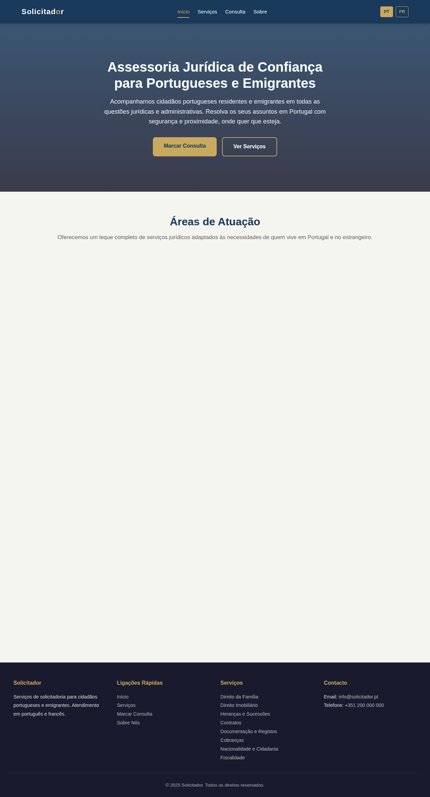
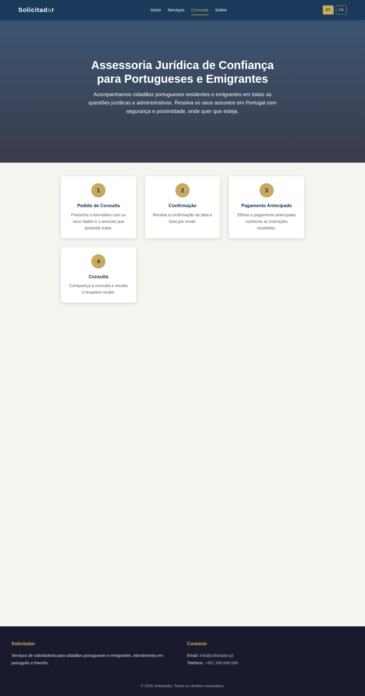
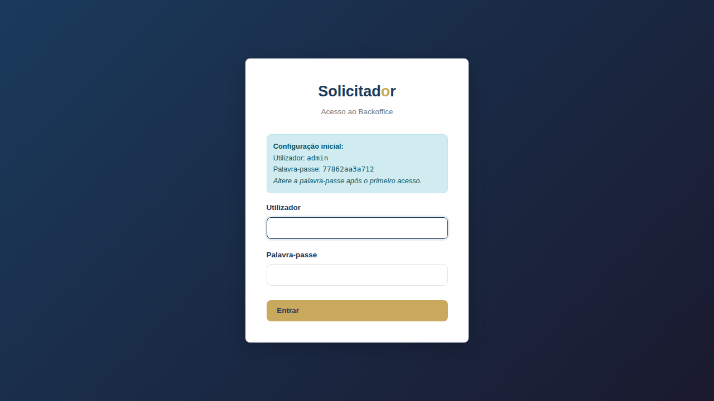
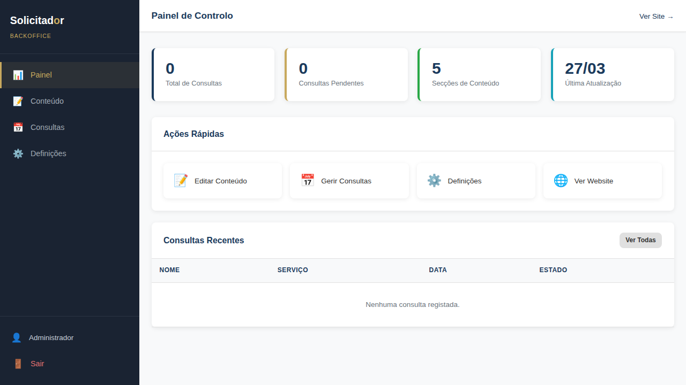
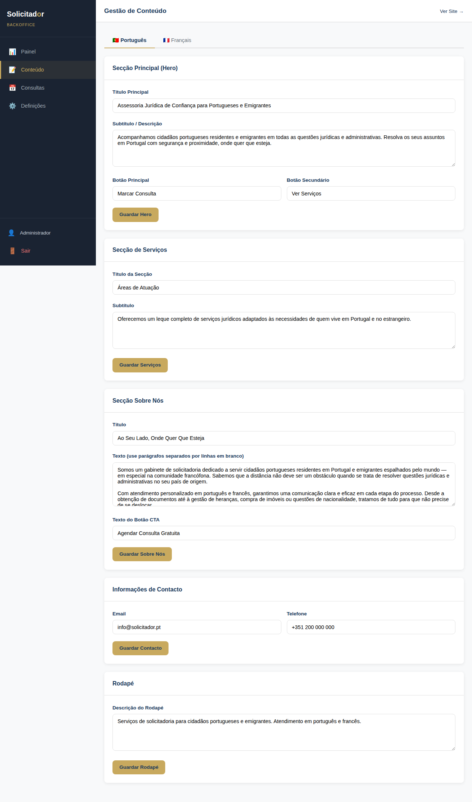
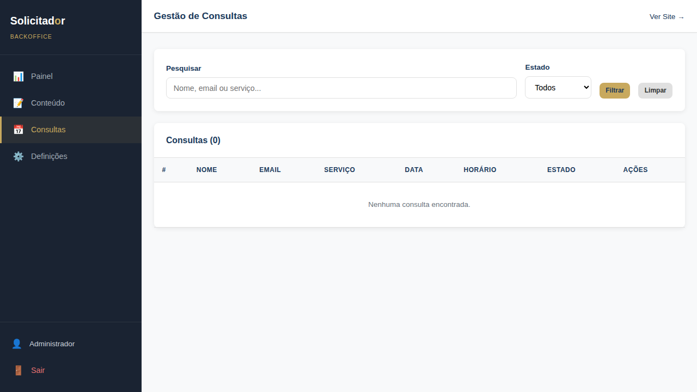

# Solicitador · Website de Serviços Jurídicos

Website profissional de serviços de solicitadoria para cidadãos portugueses residentes e emigrantes, com interface bilingue (Português/Francês) e backoffice de administração completo.

---

## 📸 Screenshots

### Website (Front-end)

**Página Inicial**



**Marcação de Consulta**



### Backoffice (Administração)

**Login**



**Painel de Controlo**



**Gestão de Conteúdo**



**Gestão de Consultas**



---

## ✨ Funcionalidades

### 🌐 Website Público

- **Interface Bilingue** — Suporte completo em Português e Francês com seletor de idioma
- **Design Responsivo** — Adaptado a dispositivos móveis, tablets e desktop
- **8 Áreas de Serviço** com páginas detalhadas:
  1. Direito da Família
  2. Direito Imobiliário
  3. Heranças e Sucessões
  4. Contratos
  5. Documentação e Registos
  6. Cobranças
  7. Nacionalidade e Cidadania
  8. Fiscalidade
- **Marcação de Consultas Online** — Formulário com validação completa, escolha de serviço, data e horário
- **Fluxo de Pagamento Antecipado** — Processo em 4 passos (pedido → confirmação → pagamento → consulta)
- **Conteúdo Dinâmico** — Carregamento de conteúdo via JSON, editável sem alterar HTML
- **Animações Suaves** — Efeitos fade-in, hover e transições CSS
- **Navegação com Menu Mobile** — Hamburger menu responsivo com acessibilidade (ARIA)

### 🔧 Backoffice de Administração

- **Autenticação Segura** — Login com sessões PHP, tokens CSRF por pedido
- **Painel de Controlo** — Estatísticas (total de consultas, pendentes, secções de conteúdo) e ações rápidas
- **Editor de Conteúdo Multilingue** — Edição de todas as secções do site (Hero, Serviços, Sobre Nós, Contacto, Rodapé) em Português e Francês
- **Gestão de Consultas** — Listagem, pesquisa, filtragem por estado (Pendente, Confirmada, Concluída, Cancelada) e atualização de estado
- **Definições** — Alteração de palavra-passe, informações do sistema
- **Exportação JSON Automática** — Alterações no backoffice geram ficheiros JSON consumidos pelo front-end

### 🔒 Segurança

- Hashing de palavras-passe (PASSWORD_DEFAULT)
- Proteção CSRF em todos os formulários
- Prepared statements (prevenção de SQL injection)
- Sanitização de inputs (htmlspecialchars, strip_tags)
- Prevenção XSS no carregamento de conteúdo (textContent em vez de innerHTML)
- Sessões com regeneração de ID

### 📧 Notificações

- Envio de email ao administrador com dados da consulta
- Email de confirmação ao cliente
- Armazenamento de todos os pedidos na base de dados

---

## 🏗️ Estrutura do Projeto

```
website-solicitador/
├── index.html                  # Página inicial (PT)
├── consulta.html               # Marcação de consulta (PT)
├── fr/                         # Versão Francesa
│   ├── index.html
│   ├── consulta.html
│   └── services/               # Páginas de serviço (FR)
├── services/                   # Páginas de serviço detalhadas (PT)
├── css/
│   └── style.css               # Estilos do website
├── js/
│   ├── main.js                 # Funcionalidades principais
│   └── content-loader.js       # Carregamento dinâmico de conteúdo
├── php/
│   └── contact.php             # Processamento do formulário de consulta
├── data/
│   ├── content-pt.json         # Conteúdo em Português
│   └── content-fr.json         # Conteúdo em Francês
├── admin/                      # Backoffice de administração
│   ├── index.php               # Login
│   ├── dashboard.php           # Painel de controlo
│   ├── content.php             # Gestão de conteúdo
│   ├── consultations.php       # Gestão de consultas
│   ├── settings.php            # Definições
│   ├── css/admin.css           # Estilos do backoffice
│   ├── js/admin.js             # JavaScript do backoffice
│   └── includes/               # Componentes PHP (auth, db, header, footer)
└── docs/
    └── screenshots/            # Imagens do projeto
```

---

## 🛠️ Tecnologias

| Componente | Tecnologia |
|---|---|
| Front-end | HTML5, CSS3, JavaScript (ES6+) |
| Back-end | PHP 8+ |
| Base de Dados | SQLite 3 (WAL mode) |
| Servidor | Apache / Nginx / PHP built-in server |

> **Sem dependências externas** — funciona apenas com HTML/CSS/JS + PHP/SQLite.

---

## 🚀 Instalação

1. Clone o repositório:
   ```bash
   git clone https://github.com/markgir/website-solicitador.git
   ```

2. Configure um servidor web com PHP (ex: Apache, Nginx) ou use o servidor embutido:
   ```bash
   cd website-solicitador
   php -S localhost:8080
   ```

3. Aceda ao backoffice em `/admin/` — a base de dados e o utilizador admin são criados automaticamente no primeiro acesso.

4. Altere a palavra-passe padrão após o primeiro login.

---

## 📝 Licença

© 2025 Solicitador. Todos os direitos reservados.